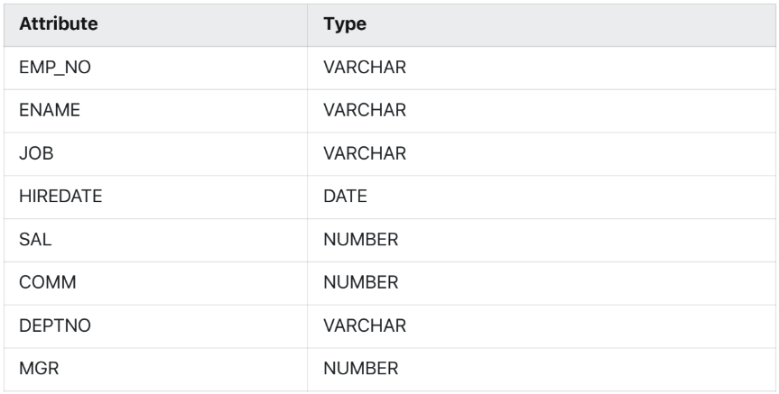
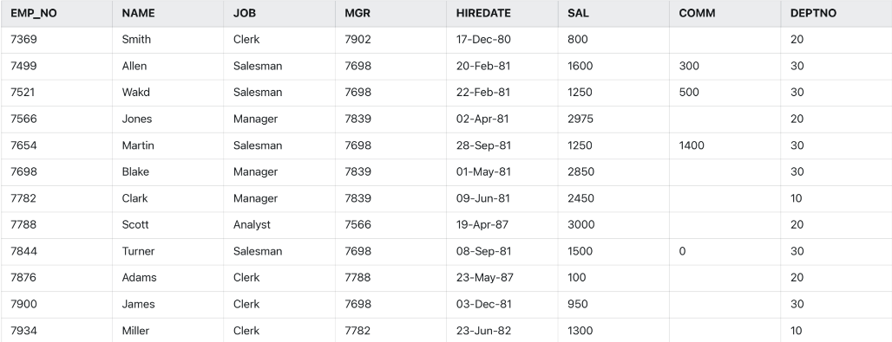

Q1) Create the Table EMP with the following attributes

```
create table Emp (
Empno varchar(20),
Ename varchar(20),
Job varchar(20),
Mgr number(4),
Hiredate date,
Sal number(7),
Comm number(5),
Deptno varchar(3) );
```

Q2) Insert Data in the Emp Table

```
insert into Emp values('7369', 'Smith', 'Clerk', 7902, '17-Dec-80', 800,null,20);
insert into Emp values('7499', 'Allen', 'Salesman', 7698, '20-Feb-81', 1600, 300, 30);
insert into Emp values('7521', 'Wakd', 'Salesman', 7698, '22-Feb-81', 1250, 500, 30);
insert into Emp values('7566', 'Jones', 'Manager', 7839, '02-Apr-81', 2975, null, 20);
insert into Emp values('7654', 'Martin', 'Salesman', 7698, '28-Sep-81', 1250, 1400, 30);
insert into Emp values('7698', 'Blake', 'Manager', 7839, '01-May-81', 2850, null, 30);
insert into Emp values('7782', 'Clark', 'Manager', 7839, '09-Jun-81', 2450, null, 10);
insert into Emp values('7788', 'Scott', 'Analyst', 7566, '19-Apr-87', 3000, null, 20);
insert into Emp values('7844', 'Turner', 'Salesman', 7698, '08-Sep-81', 1500, 0, 30);
insert into Emp values('7876', 'Adams', 'Clerk', 7788, '23-May-87', 100, null, 20);
insert into Emp values('7900', 'James', 'Clerk', 7698, '03-Dec-81', 950, null, 30);
insert into Emp values('7934', 'Miller', 'Clerk', 7782, '23-Jun-82', 1300, null, 10);
```

Q3) View the description of the EMP Table.
```
select * from Emp;
```

Q4) List all employees.
```
select Ename from Emp;
```

Q5) List the name and number of all employees.
```
select Ename, Empno from Emp;
```

Q6) List the names, employee number and department number of all clerks.
```
select Ename, Empno, Deptno from Emp where Job='Clerk';
```

Q7) List the names, employee number and salary of all Managers.
```
select Ename, Empno, Sal from Emp where Job='Manager';
```

Q8) List the names, employee number and hiredate of all analysts.
```
select Ename, Empno, Hiredate from Emp where Job='Analyst';
```

Q9) List the employees whose salary lies between 2000 and 3000.
```
select Ename from Emp where Sal>=2000 and Sal<=3000;
```

Q10) List the employees whose salary less than 1000.
```
select Ename from Emp where Sal<1000;
```

Q11) List the employees whose salary greater than 4000.
```
select Ename from Emp where Sal>4000;
```

Q12) List the employees whose salaries are 800, 1600 or 2450.
```
select Ename from Emp where Sal in (800,1600,2450);
```

Q13) List the names of all employees who are either clerks or salesman or analyst.
```
select Ename from Emp where Job in ('Clerk','Salesman','Analyst');
```

Q14) List the employee those who are not getting commission.
```
select Ename from Emp where Comm is null;
```

Q15) List the employee those who are getting commission.
```
select Ename from Emp where Comm is not null;
```

Q16) Show different type of job.
```
select Job from Emp group by Job;
```

Q17) Show name and job of each employee according to their job (ascending & descending).
```
select Ename, Job from Emp order by Job;
select Ename, Job from Emp order by Job desc;
```

Q18) Delete the information of the employee whose employee number =7369
```
delete from Emp where Empno='7369';
```

Q19) Update the employee table by changing the department no=50 of employee no 7934.
```
update Emp set Deptno=50 where Empno='7934';
```