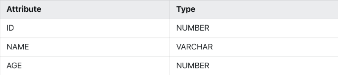
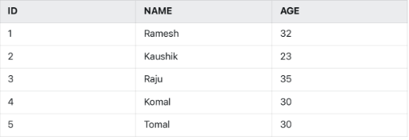
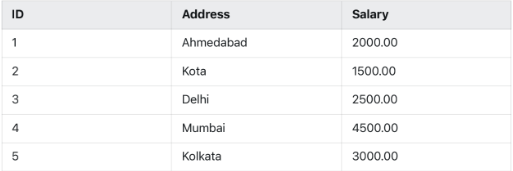

Q1) Create a table customer with the following fields <br>

```
create table Customer(
ID number(2),
Name varchar(20),
Age varchar(3));
```

Q2) Insert data in the Customer Table <br>

```
insert into Customer values (1,'Ramesh',32);
insert into Customer values (2,'Kaushik',23);
insert into Customer values (3,'Raju',35);
insert into Customer values (4,'Komal',30);
insert into Customer values (5,'Tomal',30);
```

Q3) Add two new column ADDRESS and SALARY and set the value as <br>

```
alter table Customer add (
Address varchar(20),
Salary number(5,2));

update Customer set Address='Ahmedabad', Salary=2000 where id=1;
update Customer set Address='Kota', Salary=1500 where id=2;
update Customer set Address='Delhi', Salary=2500 where id=3;
update Customer set Address='Mumbai', Salary=4500 where id=4;
update Customer set Address='Kolkata', Salary=3000 where id=5;
```

Q4) Increase Salary of Address field upto 15 characters
```
alter table Customer modify Address varchar(15);
```

Q5) List the salary of all employees with 20% increment.
```
select Salary*0.2 from Customer;
```

Q6) Select distinct ages of the Customers.
```
select Age from Customer group by Age;

OR

select distinct Age from Customer;
```

Q7) List the customer whose salary is not in the range of 3000 to 4000.
```
select Name from Customer where Salary<=3000 or Salary>=4000;
```

Q8) List the name and age of all customers whose salary is greater than 4000.
```
select Name, Age from Customer where Salary>4000;
```

Q9) Change the name of Id field as CUST_ID of customer table.
```
alter table Customer rename column ID to Cust_id;
```

Q10) Delete the information whose name start with “Ra”.
```
delete from Customer where Name like 'Ra%';
```

Q11) Drop the age column of customer table.
```
alter table Customer drop column Age;
```

Q12) Create a table customer1 from customer.
```
create table Customer1 (Cust_id, Name, Address, Salary) as select Cust_id, Name, Address, Salary from Customer;
```

Q13) Change the name of customer table to customer2.
```
alter table Customer rename to Customer2;
```

Q14) Delete all the information of customer1 table.
```
truncate table Customer1;
```

Q15) Delete all the information of customer2 table.
```
truncate table Customer2;
```

Q16) Drop the table customer1 and customer2 table.
```
drop table Customer1;
drop table Customer2;
```