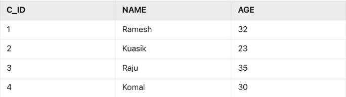

Q1) Create a table Customer and insert the data. **CD_ID** is the primary key.

```
create table Customer(
C_ID number(2) primary key,
Name varchar(20),
Age number(3));

insert into Customer values(1,'Ramesh',32);
insert into Customer values(2,'Kaushik',23);
insert into Customer values(3,'Raju',35);
insert into Customer values(4,'Komal',30);
```

Q2) Create a table Loan (shown below) and insert the following data. <br>
L_ID & NAME as primary key. <br>
C_ID is foreign key to the customer table. <br>
By default take LDATE as system date. <br>
```
create table Loan(
L_id varchar(3),
Name varchar(20),
Amount number(5),
Ldate date,
Lc_id number(2),
primary key(L_id,Name),
foreign key (Lc_id) references Customer(C_id)
);

insert into Loan values('L01','Ravi',3000,'21-Dec-81',null);
insert into Loan values('L02','Ramesh',4000,Sysdate,1);
insert into Loan values('L03','Kaushik',2000,Sysdate,2);
```

Q3) Insert a record in Customer table as C_ID=1, Name=Tomal, Age=30.
```
insert into Customer values(1,'Tomal',30);

ORA-00001: unique constraint (SQL_CMJYMSTQBNRXEKRWTYIABGZNO.SYS_C0089946195) violated ORA-06512: at "SYS.DBMS_SQL", line 1721
```

Q4) Insert a record as L04, Raju, 5000, 02-apr-93, 6.
```
insert into Loan values('L04','Raju',5000,'02-Apr-93',6);

ORA-02291: integrity constraint (SQL_CMJYMSTQBNRXEKRWTYIABGZNO.SYS_C0089947191) violated - parent key not found ORA-06512: at "SYS.DBMS_SQL", line 1721
```

Q5) Delete a record of customer table whose C_id=1.
```
delete from Customer where C_id=1;

ORA-02292: integrity constraint (SQL_CMJYMSTQBNRXEKRWTYIABGZNO.SYS_C0089947191) violated - child record found ORA-06512: at "SYS.DBMS_SQL", line 1721
```

Q6) Drop foreign key constraint of Loan table.
```
select Constraint_name, Constraint_type from user_constraint where table_name='Loan';

alter table Loan drop constraint <constraint_name>;
```

Q7) Give Lc_id as foreign key of Loan table with on delete cascade option.
```
alter table Loan constraint ab_key foreign key (Lc_id) references customer(C_id) on delete cascade;
```