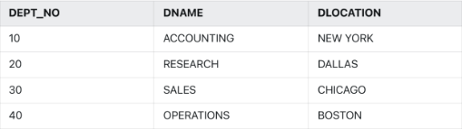
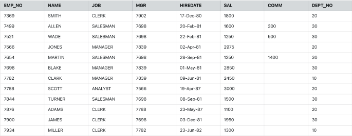

Q1) Create the Following Department Table with **Dept_no** as the Primary Key. <br>

```
create table Department(
Dept_no number(3),
Dname varchar(20),
Dlocation varchar(20),
primary key(Dept_no));

insert into Department values(10,'Accounting','New York');
insert into Department values(20,'Research','Dallas');
insert into Department values(30,'Sales','Chicago');
insert into Department values(40,'Operations','Boston');
```

Q2) Create the following Emp Table with Deptno as the foreign key referencing to the Department Table and Salary should not be less than 1000. <br>

```
create table Emp(
Empno number(4),
Ename varchar(20),
Job varchar(20),
Mgr number(4),
Hiredate date,
Sal number(4),
Comm number(4),
Deptno number(3),
primary key(Empno),
foreign key(Deptno) references Department(Dept_no),
check (Sal>=1000));

insert into Emp values('7369', 'Smith', 'Clerk', 7902, '17-Dec-80', 1800,null,20);
insert into Emp values('7499', 'Allen', 'Salesman', 7698, '20-Feb-81', 1600, 300, 30);
insert into Emp values('7521', 'Wakd', 'Salesman', 7698, '22-Feb-81', 1250, 500, 30);
insert into Emp values('7566', 'Jones', 'Manager', 7839, '02-Apr-81', 2975, null, 20);
insert into Emp values('7654', 'Martin', 'Salesman', 7698, '28-Sep-81', 1250, 1400, 30);
insert into Emp values('7698', 'Blake', 'Manager', 7839, '01-May-81', 2850, null, 30);
insert into Emp values('7782', 'Clark', 'Manager', 7839, '09-Jun-81', 2450, null, 10);
insert into Emp values('7788', 'Scott', 'Analyst', 7566, '19-Apr-87', 3000, null, 20);
insert into Emp values('7844', 'Turner', 'Salesman', 7698, '08-Sep-81', 1500, 0, 30);
insert into Emp values('7876', 'Adams', 'Clerk', 7788, '23-May-87', 1100, null, 20);
insert into Emp values('7900', 'James', 'Clerk', 7698, '03-Dec-81', 1950, null, 30);
insert into Emp values('7934', 'Miller', 'Clerk', 7782, '23-Jun-82', 1300, null, 10);
```

Q3) List the employees earned more than any employee in Chicago.
```
select Ename from Emp,Department where Emp.Deptno=Department.Dept_no and Sal>(select Max(Sal) from Emp,Department where Emp.Deptno=Department.Dept_no and Dlocation='Chicago');
```

Q4) Display the name of the department whose job is salesman.
```
select Dname from Department, Emp where Emp.Deptno=Department.Dept_no and Job='Salesman' group by Dname;
```

Q5) Display the name of the department in which Smith works.
```
select Dname from Department, Emp where Emp.Deptno=Department.Dept_no and Ename='Smith';
```

Q6) Display the name of department whose salary is maximum.
```
select Dname from Department, Emp where Emp.Deptno=Department.Dept_no and Sal=(select Max(Sal) from Emp);
```

Q7) Display the name of the city in which Smith works.
```
select Dlocation from Department, Emp where Emp.Deptno=Department.Dept_no and Ename='Smith';
```

Q8) Display the name of the city in which manager works.
```
select Dlocation from Department, Emp where Emp.Deptno=Department.Dept_no and Job='Manager';
```

Q9) List the employees who earn more than every employee in Dallas.
```
select Ename from Emp where Sal>(select Max(Sal) from Emp, Department where Emp.Deptno=Department.Dept_no and Dlocation='Dallas');
```

Q10) List all employees who work in Dallas or have joined the company as manager before 1982.
```
SELECT Ename FROM Emp, Department WHERE (Emp.Deptno = Department.Dept_no AND Dlocation='Dallas') OR (Emp.Deptno = Department.Dept_no AND Job='Manager' AND Hiredate< '01-JAN-82');
```

Q11) List all employees who work in Dallas and earned more than any employee work in Chicago.
```
select Ename from Emp, Department where Emp.Deptno = Department.Dept_no and Dlocation='Dallas' and Sal>(select Max(Sal) from Emp, Department where Emp.Deptno = Department.Dept_no and Dlocation='Chicago');
```

Q12) List all employees who earned more than every employee in the Accounting department.
```
select Ename from Emp, Department where Emp.Deptno = Department.Dept_no and Sal>(select Max(Sal) from Emp, Department where Emp.Deptno = Department.Dept_no and Dname='Accounting');
```