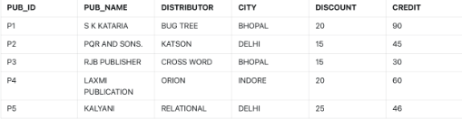
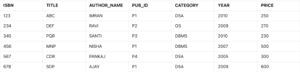
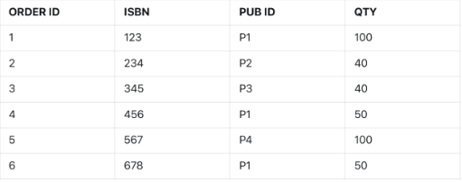

Q1) Create the Publisher Table with **Pub_id** as the Primary key and **Pub_id** should always start with 'P' <br>

```
create table Publisher(
Pub_id varchar(2),
Pub_name varchar(20),
Distributor varchar(20),
City varchar(20),
Discount number(2),
Credit number(2),
primary key(Pub_id),
check (Pub_id like 'P%'));

insert into Publisher values ('P1','S K Kataria','Bug Tree','Bhopal',20,90);
insert into Publisher values ('P2','PQR and Sons','Katson','Bhopal',15,45);
insert into Publisher values ('P3','RJB Publishers','Cross Word','Bhopal',15,30);
insert into Publisher values ('P4','Laxmi Publication','Orion','Bhopal',20,60);
insert into Publisher values ('P5','Kalyani','Bug Tree','Relational',25,46);
```


Q2) Create the Author Table with **ISBN** as the Primary Key, *Pub_id* as the Foreign Key referencing *Pub_id* of Publisher Table and Price should not be more than 50. <br>

```
create table Author(
ISBN number(3),
Title varchar(3),
Author_name varchar(20),
Pub_id varchar(2),
Category varchar(5),
Year number(4),
Price number(3),
primary key(ISBN),
foreign key(Pub_id) references Publisher(Pub_id),
check (Price>50));

insert into Author values(123,'ABC','Imran','P1','DSA',2010,250);
insert into Author values(234,'DEF','Ravi','P2','OS',2009,270);
insert into Author values(345,'PQR','Santi','P3','DBMS',2010,230);
insert into Author values(456,'MNP','Nisha','P1','DBMS',2007,500);
insert into Author values(567,'CDR','Pankaj','P4','DSA',2005,300);
insert into Author values(678,'SDP','Ajay','P1','DSA',2009,600);
```

Q3) Create table Order_table with **Order_id** as the Primary Key, Foreign Key *ISBN* referencing to Author Table, Foreign Key *Pub_id* referencing to Publisher Table, Qty should be more than zero. <br>

```
create table Order_table(
Order_id number(1),
ISBN number(3),
Pub_id varchar(2),
Qty number(4),
primary key(Order_id),
foreign key(ISBN) references Author(ISBN),
foreign key(Pub_id) references Publisher(Pub_id),
check ( Qty>0 ));

insert into Order_table values(1, 123, 'P1', 100);
insert into Order_table values(2, 234, 'P2', 40);
insert into Order_table values(3, 345, 'P3', 40);
insert into Order_table values(4, 456, 'P1', 50);
insert into Order_table values(5, 567, 'P4', 100);
insert into Order_table values(6, 678, 'P1', 50);
```

Q4) Get the titles of the book whose price is more than the average price.
```
select Title from Author where Price>(select AVG(Price) from Author);
```

Q5) Get the details of publishers who are supplying the title ‘PQR’ to the book shop.
```
select * from Publisher, Author where Publisher.Pub_id=Author.Pub_id and Title='PQR';
```

Q6) Get the details of all books whose price is less than the average price of ‘DBMS’ book.
```
select * from Author where Price<(select AVG(Price) from Author where Category='DBMS');
```

Q7) Get the name of distributor who are supplying book ‘ABC’
```
select Distributor from Publisher, Author where Publisher.Pub_id=Author.Pub_id and Title='ABC';
```

Q8) Get the details of all the publishers who are giving more discount than the average discount.
```
select Pub_name from Publisher where Discount>(select AVG(Discount) from Publisher);
```

Q9) Get the name of all distributors who are supplying the book whose author is ‘AJAY’.
```
select Distributor from Publisher, Author where Publisher.Pub_id=Author.Pub_id and Author_name='Ajay';
```

Q10) Get detail of all the authors whose book price is greater than the maximum of the average category.
```
select * from Author where Price > (select max(avg(Price)) from Author group by Category);
```

Q11) Get the second maximum price of the book.
```
select Max(Price) from Author where Price <(select Max(Price) from Author);
```